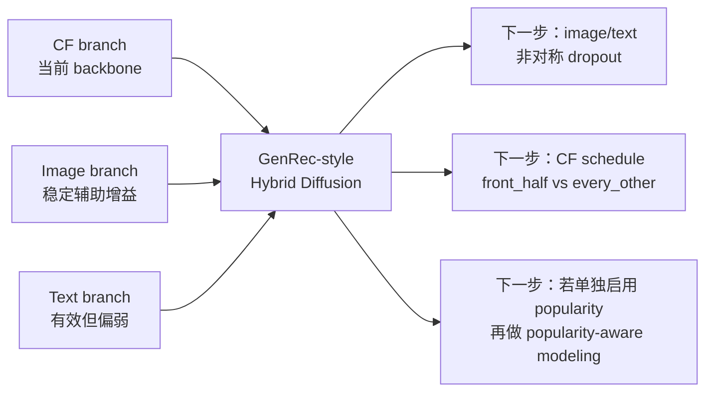

# Diffusion RecSys 最新汇报补充

基于以下两份材料整理：

- 原汇报 PDF：[Diffusion RecSys.pdf](</C:/Users/14466/Desktop/Diffusion RecSys.pdf>)
- 最新 `v12_fronthalf` 消融总结：[compare_latest.txt](</C:/Users/14466/Desktop/20260414_144939/compare_latest.txt>)

本文档用于替换并续写原 PDF 后半段内容，重点补充：

1. 将原 PDF 第 11 节之后的正式总结整理为可直接汇报的 Markdown 版本。
2. 将最新 `GenRec-style hybrid diffusion v1.2 front_half` 结果并入总结，形成比 PDF 更晚的结论版本。
3. 明确哪些旧结论仍然成立，哪些需要根据最新实验修正。

---

## 11. 可直接用于汇报的正式总结

本阶段工作围绕 Diffusion Transformer 在推荐系统中的适配展开。早期直接将扩散建模迁移到推荐任务中，虽然可以实现训练 loss 的稳定下降，但检索质量极弱，说明连续 latent 去噪并不能自然转化为有效的 top-k 推荐能力。为解决这一问题，项目将原始方案逐步重构为 GenRec-style hybrid diffusion recommendation pipeline：以 semantic-ID token 组织用户历史，以 diffusion denoising 预测目标 item latent，并结合 text、image、CF 等条件分支，通过结构化 cross-attention 方式完成推荐建模。

在这一重构过程中，项目已经完成了从原始数据处理、embedding 构建、semantic ID 量化、tokenized sample 生成，到训练、评估、分组分析与消融实验的完整技术链路搭建。当前版本不再停留在“能够训练起来但无法形成有效推荐”的阶段，而是已经具备稳定的 top-k 检索能力，并能够围绕 cold、mid、hot 三类样本开展细粒度分析。这意味着项目已经从“扩散模型可否用于推荐”的早期验证，推进到了“如何让扩散推荐系统具备结构性收益和多模态收益”的研究阶段。

从较早的正式消融结果看，当前系统已经呈现出较清晰的模块分工。CF 分支是主体检索能力的核心 backbone；image 分支提供稳定且不可忽视的辅助增益；text 分支有效但边际收益偏弱；popularity 分支更像偏置调节器而非主语义来源。与此同时，静态 popularity penalty 虽然能抑制热门项，但并不能真正提升冷门组的 top-k 指标，反而容易对热门组乃至 overall 带来负收益。因此，原阶段性结论是：GenRec-style hybrid diffusion 路线已经可行，CF 是当前主干，image 强于 text，而静态 popularity penalty 不应作为长尾建模的最终方案。

综合来看，本阶段工作的最大价值，不只是拿到一组优于早期原型的指标，而是完成了扩散推荐系统从“原型试验”到“结构化研究平台”的转变。当前系统已经具备继续开展多模态增强、长尾建模、条件注入策略优化与结构消融验证的基础，为下一阶段研究提供了可靠起点。

---

## 12. 基于 `v12_fronthalf` 的最新实验更新

### 12.1 更新背景

在原 PDF 结论基础上，项目又完成了一版新的结构实验：`GenRec hybrid diffusion v1.2 front_half`。这版的核心变化不是继续强化 popularity，而是调整多模态条件注入方式：

- `text`：全层独立注入
- `image`：全层独立注入
- `CF`：仅在前半层注入
- `popularity`：不再作为主干中逐层的重条件分支

这版实验的目的，不是削弱 CF 的 backbone 地位，而是验证：在保留 CF 主干作用的同时，能否通过后半层释放表示空间，使 image/text 获得更清晰的结构性收益。

### 12.2 最新整体结果

`compare_latest.txt` 中 `full` 对应的最新结果如下：

| Metric | Value |
| --- | ---: |
| Mean Rank | 3251.9276 |
| Hit@10 | 0.064185 |
| NDCG@10 | 0.057486 |
| Hit@20 | 0.070778 |
| NDCG@20 | 0.059141 |

与原 PDF 中较早一版正式 full 结果相比：

| Metric | 旧版 Full | `v12_fronthalf` Full | 变化 |
| --- | ---: | ---: | ---: |
| Mean Rank | 3144.07 | 3251.93 | 变差 |
| Hit@20 | 0.06689 | 0.07078 | +0.00389 |
| NDCG@20 | 0.05557 | 0.05914 | +0.00357 |

这说明一个重要现象：**虽然 Mean Rank 没有同步改善，但真正更重要的 top-k 指标（Hit@20 / NDCG@20）是提升的。** 这进一步支持原 PDF 中的判断：后续汇报不应再把 Mean Rank 当作最主要结论指标，而应优先使用 Hit@20 和 NDCG@20 判断推荐效果。

### 12.3 最新消融结果总表

需要先说明一个方法学细节：当前 `v12_fronthalf` active 配置里已经设置了 `use_popularity: false` 且 `layer_injection.popularity: none`。这意味着 popularity branch 在训练和评估主模型中都未实际启用。因此，本轮 `no_popularity` 与 `full` 的差异不应被解释为“移除 popularity 带来的真实收益或损失”，更可能是扩散评估采样随机性带来的波动。也正因为如此，下面的正式分析将把 `no_popularity` 视为一组随机性对照，而不是有效的结构消融证据。

以下为 `v12_fronthalf` 的最新正式消融结果。由于 `no_popularity` 在本轮并不是有效结构消融，下面只保留可以正式解读的分支：

| Variant | Mean Rank | Hit@10 | NDCG@10 | Hit@20 | NDCG@20 | 相对 Full 的主要变化 |
| --- | ---: | ---: | ---: | ---: | ---: | --- |
| full | 3251.9276 | 0.064185 | 0.057486 | 0.070778 | 0.059141 | 基线 |
| no_text | 3257.0985 | 0.063556 | 0.057327 | 0.070778 | 0.059142 | overall 几乎不变，text 贡献仍偏弱 |
| no_cf | 4623.1178 | 0.054148 | 0.051484 | 0.056926 | 0.052185 | 显著崩塌，CF 仍是绝对主干 |
| no_image | 3262.8621 | 0.063593 | 0.057251 | 0.069852 | 0.058807 | 整体小幅退化，image 仍有稳定收益 |

### 12.4 最新分组结果

#### Cold 组

| Variant | Hit@20 | Delta | NDCG@20 | Delta |
| --- | ---: | ---: | ---: | ---: |
| full | 0.009035 | +0.000000 | 0.003376 | +0.000000 |
| no_text | 0.007713 | -0.001322 | 0.002875 | -0.000501 |
| no_cf | 0.002204 | -0.006831 | 0.000806 | -0.002570 |
| no_image | 0.007933 | -0.001102 | 0.003428 | +0.000052 |

#### Mid 组

| Variant | Hit@20 | Delta | NDCG@20 | Delta |
| --- | ---: | ---: | ---: | ---: |
| full | 0.015785 | +0.000000 | 0.007707 | +0.000000 |
| no_text | 0.016674 | +0.000889 | 0.008200 | +0.000493 |
| no_cf | 0.004002 | -0.011783 | 0.001777 | -0.005930 |
| no_image | 0.016674 | +0.000889 | 0.008981 | +0.001274 |

#### Hot 组

| Variant | Hit@20 | Delta | NDCG@20 | Delta |
| --- | ---: | ---: | ---: | ---: |
| full | 0.100145 | +0.000000 | 0.086107 | +0.000000 |
| no_text | 0.100256 | +0.000111 | 0.086111 | +0.000004 |
| no_cf | 0.084001 | -0.016143 | 0.077785 | -0.008321 |
| no_image | 0.098809 | -0.001336 | 0.085273 | -0.000834 |

---

## 13. 基于最新结果的结论修正

### 13.1 哪些旧结论依然成立

#### 1. `CF` 仍然是当前系统的核心 backbone

这一点在最新 `v12_fronthalf` 结果上被进一步强化。即使已经把 `CF` 从“全层注入”改成“只在前半层注入”，`no_cf` 依然造成了最明显的性能崩塌：

- `Hit@20`: `0.070778 -> 0.056926`
- `NDCG@20`: `0.059141 -> 0.052185`
- 三组样本同时明显退化，尤其 `cold` 和 `mid` 下降最为严重

因此，最新结论不是“front_half 已经让多模态取代 CF”，而是：**front_half 在没有破坏 CF backbone 地位的前提下，为后续多模态增强创造了更合理的结构空间。**

#### 2. `image` 仍然强于 `text`

从整体结果看，`no_image` 的退化仍然比 `no_text` 更一致：

- `no_image`：`Hit@20 -0.000926`，`NDCG@20 -0.000334`
- `no_text`：`Hit@20 0.000000`，`NDCG@20 +0.000001`

分组上也是类似趋势：

- `image` 去掉后，`hot` 组明显下降
- `text` 去掉后，`hot` 基本不变

这说明 `image` 依然是当前最有用的辅助模态，而 `text` 虽然有效，但边际贡献仍较弱。

### 13.2 哪些旧结论需要修正

#### 1. 不能再用这轮 `no_popularity` 结果推断 popularity 的真实作用

最新补查代码后可以确认：当前 `v12_fronthalf` 配置中 popularity branch 实际没有参与训练，也没有参与评估主模型。因此，这一轮 `full` 与 `no_popularity` 之间出现的小幅差异，不应被解释为 popularity 的真实贡献，而应视为扩散采样随机性下的浮动。

因此，更新后的结论应改写为：

> 对于当前 `v12_fronthalf` 这轮实验，`no_popularity` 不是有效的结构消融，不能据此得出“popularity 对 cold 有帮助”或“popularity 应保留”的正式研究结论。若后续要重新评估 popularity，需要先显式启用 popularity branch，并在固定 eval seed 的前提下重新做对照。

#### 2. `front_half` 的价值主要体现为“结构方向正确”，而不是“多模态收益已被完全释放”

最新结果说明，`front_half` 的确没有破坏整体 top-k 表现，甚至在 Hit@20 / NDCG@20 上较早期 full 结果更好；但与此同时，`text` 和 `image` 的收益并没有在这版上被显著放大。

因此，这版实验最可靠的解释不是：

> front_half 已经显著激活了多模态价值。

而是：

> front_half 已经证明“降低 CF 持续侵入”是可行的，但当前多模态分支，尤其 text，仍然偏弱，后续还需要进一步通过非对称 dropout、token-level 注入优化或更细粒度的 layer schedule 来释放其价值。

---

## 14. 最新阶段性研究判断

基于原 PDF 结论与 `v12_fronthalf` 最新结果，可以得到一组更稳妥的最新判断。

### 14.1 当前系统已进入“可研究优化”阶段，而不再是“可不可用”阶段

无论是原 PDF 中的正式 full 结果，还是最新 `v12_fronthalf` full 结果，都说明系统已经具备稳定的 top-k 检索能力。当前工作的重点，不再是证明扩散推荐是否可行，而是识别：

- 哪些条件分支真正提供可复现收益
- 哪些结构设计能提升 cold/mid/hot 的平衡
- 哪些长尾增强策略是有效的

### 14.2 `CF` 是主干，多模态仍处于“辅助但未完全释放”的阶段

当前最佳理解不是“CF 和多模态并列”，而是：

- `CF` 负责主体检索结构
- `image` 提供稳定辅助收益
- `text` 提供较弱但可能可挖掘的语义补充
- `popularity` 在当前这轮 `v12_fronthalf` 实验中未实际启用，因此不参与本轮正式结论

换言之，当前系统仍是 **CF 主导、多模态增强** 的范式，而不是“多模态主导、CF 退居次要”的范式。

### 14.3 `image` 可能存在压制 `text` 的嫌疑，但尚未被最终证明

最新 `v12_fronthalf` 结果与更早结论放在一起看，会得到一个值得重点追踪的信号：

- `image` 的收益稳定强于 `text`
- `text` 的贡献弱且不稳定
- `front_half` 并未自动放大 `text` 的收益

这使得“image 在训练中更容易成为捷径，并间接压制 text 学习”的假设变得更值得验证。但仅凭当前结果，还不能把它当成确定结论。更合理的表述是：

> 当前结果支持“image 可能压制 text”的研究假设，但仍需通过 image/text 非对称 dropout 或分层注入策略的对照实验进一步验证。

### 14.4 `popularity-aware modeling` 仍然值得推进，但需基于单独启用 popularity 的新实验

虽然当前 `v12_fronthalf` 这轮结果不能再被用来判断 popularity 的真实价值，但并没有改变更大的方向：**静态 popularity penalty 不是最终解法。**

真正值得继续推进的是：

- 将 popularity 从外部静态惩罚转为模型内部条件
- 让模型根据用户历史动态判断应该偏向热门项还是长尾项
- 把 popularity 设计成弱先验、门控或轻量 branch，而不是强行重排所有候选

---

## 15. 下一阶段建议

### 15.1 优先建议一：在 `front_half` 基础上做 image/text 非对称 dropout

最新结果显示：

- `CF` 已经在 `front_half` 下稳定工作
- `image` 强于 `text`
- `text` 仍然偏弱

因此，最值得优先验证的一步，不是继续大幅削弱 `CF`，而是测试：

> 在保持 `CF = front_half` 不变的情况下，增加 image 的 dropout 强度、降低 text 的 dropout 强度，是否能够释放 text 的边际价值。

这将直接回答“image 是否吞掉 text 信息”这一关键问题。

### 15.2 优先建议二：在 `front_half` 之后继续比较 `every_other`

`front_half` 当前更像结构方向验证版，而 `every_other` 更像折中优化版。等 `front_half` 结果稳定后，再比较：

- `CF = front_half`
- `CF = every_other`

可以更清楚地回答：

- 是彻底把后半层释放给多模态更有效
- 还是让 CF 以更低频率持续参与全程更有效

### 15.3 优先建议三：若要继续研究 popularity，应重构其作用方式并单独重跑实验

根据目前更正后的判断，当前最合理的路线不是继续解读这轮 `no_popularity` 浮动，而是：

- 保留 popularity 的弱条件作用
- 减轻其对 mid/hot 的不必要干扰
- 逐步改造成 popularity-aware branch 或动态 prior

---

## 16. 可直接放进汇报首页或结尾页的简版结论

可将当前阶段最新结论概括为如下四点：

1. `GenRec-style hybrid diffusion` 路线已经被验证为可行，系统已具备稳定的 top-k 检索能力。
2. `CF` 仍是当前系统最关键的 backbone，即使在 `front_half` 结构下也未被替代。
3. `image` 仍是最有效的辅助模态，`text` 有帮助但贡献偏弱，后续需要进一步验证 image 是否压制了 text 的学习空间。
4. 当前 `v12_fronthalf` 的正式结论不包含 popularity 的真实作用判断；但静态 popularity penalty 仍不是最终解法，若后续继续研究 popularity，应转向显式启用 branch 后的更细粒度 popularity-aware modeling。

---

## 附：一张简化关系图

